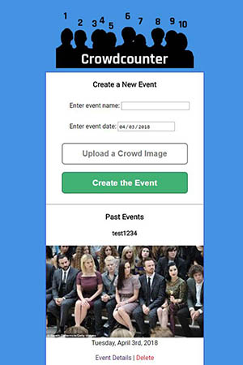

# Crowdcounter
A visual recognition app for counting crowds (currently of 100 or less) from an image.

## Status

## Motivation

Attendance is tracked carefully for ticketed events, but for events attended by the wider public (e.g. meetups, church services, demonstrations, free concerts, etc.) it can be hard to get a true count of attendees - especially if the crowd is in flux. Crowdcounter attempts to leverage the growing power of machine learning apps (specifically AWS Rekognition) to provide a count of faces from images and draws bounding boxes on the faces detected.

## Screenshots

Event list:

Event details:

Another event's details:

## Built With

### Front-End
* HTML & HTML Canvas
* CSS
* Javascript (with JQuery and AJAX)

### Back-End
* Node.js
* Express
* MongoDB / Mongoose
* Passport.js and JWT for user authentication
* AWS S3 & Rekognition for image storage and analysis

## Features

* User signup, login, and authentication system using JWT and passport.js.
* Crowd images are stored to S3 and analyzed using AWS Rekognition's detectFaces API. 
* Event results and user accounts stored in a Mongo database.
* Bounding boxes are programmatically drawn on an HTML Canvas instance to show which faces are counted.
* Support for editable event names and dates, as well as deleting events.

## Demo

- [Live Demo](https://crowdcounter.herokuapp.com/)

## Authors

* **Jeff Woleslagle** - Design and development